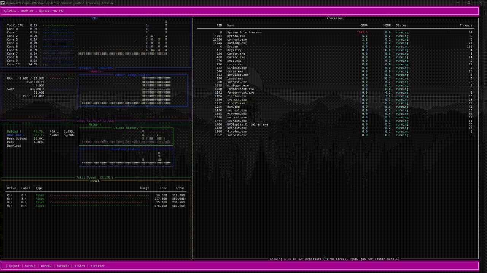

# 💻 SysView

Современный монитор системных ресурсов в стиле btop, написанный на Python с использованием библиотеки Rich.


<div align="center">
  
</div>

## ✨ Возможности

* Мониторинг CPU с отображением нагрузки на ядра, температуры и частоты
* Мониторинг памяти (RAM и SWAP) с графиками использования
* Мониторинг сети с графиками скорости загрузки/отдачи
* Мониторинг дисков с информацией о I/O
* Список процессов с сортировкой по использованию ресурсов
* Красивый интерфейс с поддержкой тем
* Поддержка графиков в стилях: braille, block и tty
* Автоматическое масштабирование графиков
* Информация о батарее (если доступна)

## 🛠️ Требования

* Python 3.7 или новее
* psutil >= 5.9.0
* rich >= 13.0.0
* click >= 8.0.0

## 🚀 Установка

1. Клонируйте репозиторий:
```bash
git clone https://github.com/yourusername/sysview.git
cd sysview
```

2. Установите зависимости:
```bash
pip install -r requirements.txt
```

3. Запустите приложение:
```bash
python sysview.py
```

## 🎨 Использование

```bash
python src/sysview.py [OPTIONS]

Options:
  -i, --interval FLOAT  Интервал обновления в секундах (по умолчанию: 1.0)
  -t, --theme TEXT     Тема оформления (по умолчанию: default)
  --help              Показать справку
```

## Конфигурация

Файл конфигурации создается автоматически при первом запуске в `~/.config/sysview/sysview.conf`.
Основные настройки:

* `color_theme`: Тема оформления
* `graph_symbol`: Тип символов для графиков (braille/block/tty)
* `update_ms`: Интервал обновления в миллисекундах
* `show_battery`: Показывать информацию о батарее
* `proc_sorting`: Метод сортировки процессов
* `show_disk_io`: Показывать информацию о дисковом вводе/выводе

## ⌨️ Горячие клавиши

* `q` или `Ctrl+C`: Выход
* `h`: Показать справку
* `m`: Показать меню
* `1-5`: Переключение между предустановленными layout'ами

## 📝 Лицензия

Этот проект распространяется под лицензией MIT. Подробности смотрите в файле [LICENSE](LICENSE).

## 🤝 Вклад в проект

Мы приветствуем ваш вклад в развитие проекта! Вот как вы можете помочь:

1. Форкните репозиторий
2. Создайте ветку для ваших изменений
3. Внесите изменения
4. Отправьте пулл-реквест

## 📞 Поддержка

Если у вас возникли вопросы или проблемы:
- Напишите в Telegram: @MrMeowMurk

---

<div align="center">
Сделано с ❤️ MeowMurk
</div>
